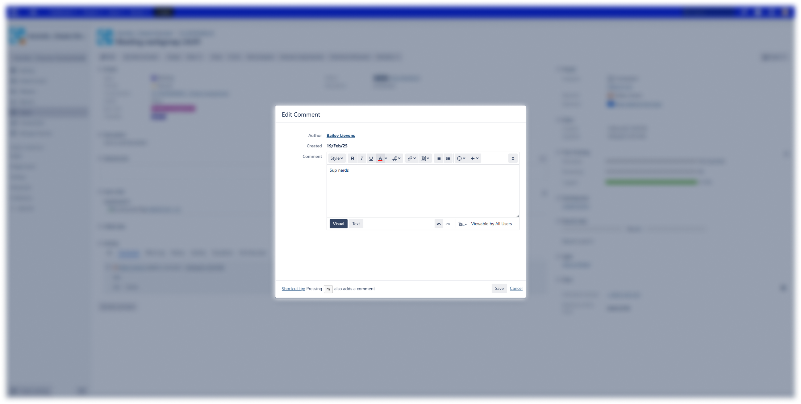

# Jira could do better, but they won't
This plugin only works on the JIRA installation of iO. The plugin has no access to anything but url's that match ```https://jira.hosted-tools.com/browse/*```.

## What it do 👀
A simple Chrome extension that makes the edit issue pop up larger. Because goddamn is it small and I like
to write large comments.

Without the extension:


With the extension:


## How to install 🛠️
Seeing as Google wants me to create a developer account and pay an entrance fee, this is more complicated than it should be.

1. Download the latest release of this repo and unpack it somewhere you want to store it
2. Go to [chrome://extensions](chrome://extensions)
3. Enable `Developer mode`
4. Click on `Load unpacked`
5. Click on the directory where you saved this repo
6. Click select folder
7. Badabing badaboom it's installed and it will do it's thing

## Bugs 🐞
- The Visual and Text button are outside their box, no idea why
- When clicking on Text the input field is smaller, I know why, but I can't be bothered to fix it because who uses that anyway

Honestly, I think that's all.

## Change requests 🏳️‍⚧️
None will be taken and none will be fixed unless it bothers me

## FAQ
### Can I disable the plugin?
No idea how to make that so no, but you can uninstall it :))

### Is it vegan?
Yes! No animals were hurt in the process of making this and this plugin does not have any direct
consequence on animals.

### Why?
Because my comments are large and I always hated to use that small interface for editing my comments.

### Is this useful for me?
1. Do you work for iO?
2. Do you also write big comments?

If you answered yes to both, then yes.